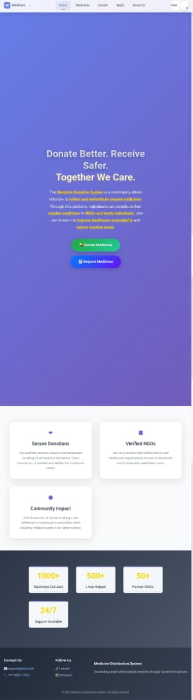
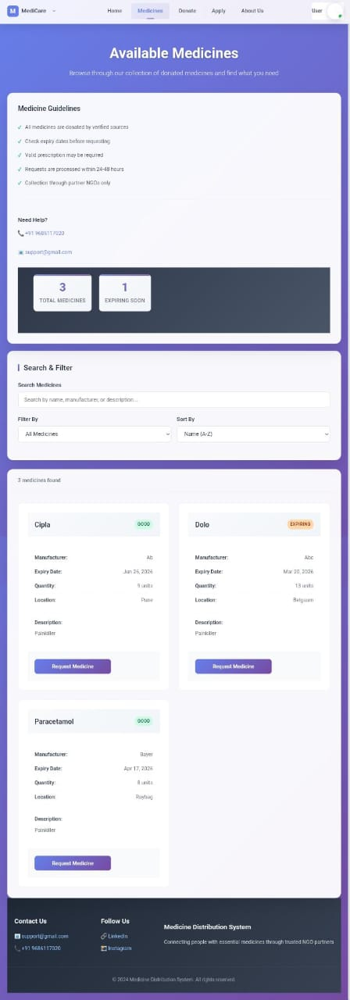
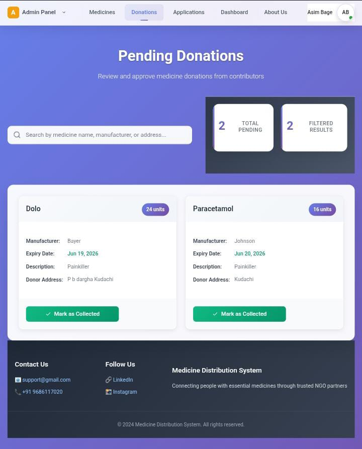
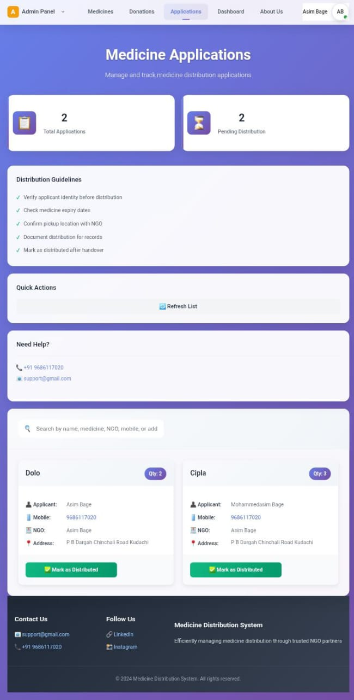
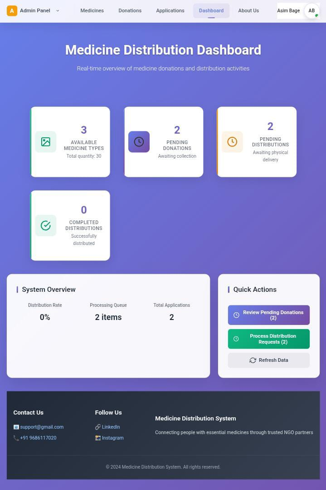
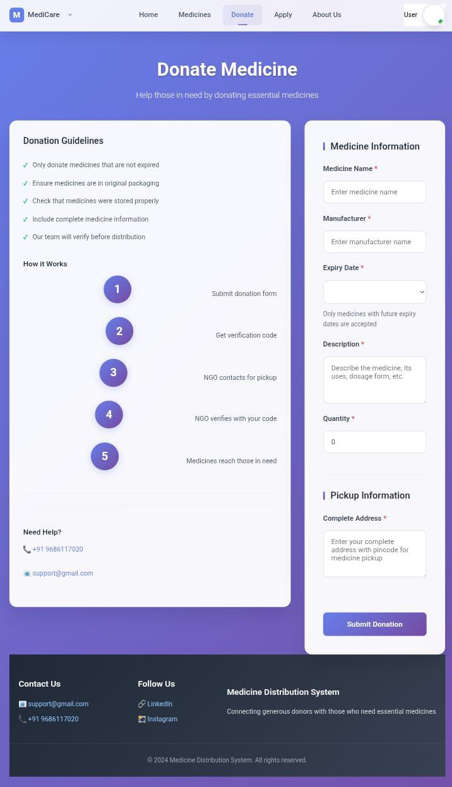
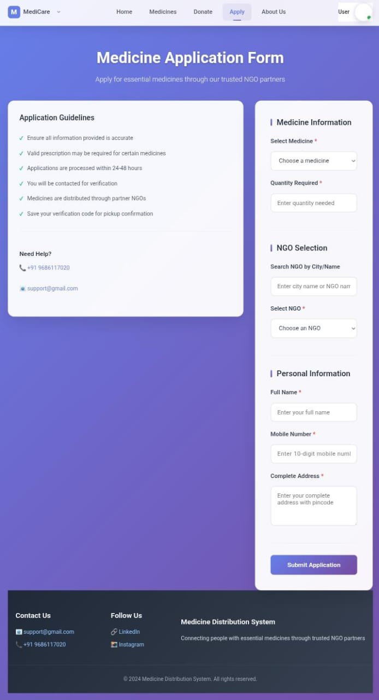

# 🏥 Medicine Donation System - Frontend

A modern, responsive web application built with React that enables efficient medicine donation and distribution through verified NGOs.

[][Live Url](https://preeminent-mochi-42cfb6.netlify.app)
[](https://reactjs.org/)
[](LICENSE)

## 📋 Table of Contents

- [Overview](#overview)
- [Features](#features)
- [Tech Stack](#tech-stack)
- [Getting Started](#getting-started)
- [Project Structure](#project-structure)
- [Environment Variables](#environment-variables)
- [Available Scripts](#available-scripts)
- [API Integration](#api-integration)
- [Screenshots](#screenshots)
- [Contributing](#contributing)
- [License](#license)

## 🎯 Overview

The Medicine Donation System (MDS) Frontend is a user-friendly interface that connects medicine donors with NGOs and beneficiaries. It provides a seamless experience for donating unused medicines, applying for needed medicines, and tracking the entire process through a secure verification system.

**Live Application:** [[Live URL](https://preeminent-mochi-42cfb6.netlify.app)]

**Backend Repository:** [mds-backend](https://github.com/mdasimbage786/mds-backend)

## ✨ Features

### For Donors/Applicants
- 🔐 Secure user authentication and registration
- 💊 Easy medicine donation with verification codes
- 📝 Apply for required medicines from available inventory
- 🔍 Real-time status tracking of donations and applications
- 📊 Personal dashboard with activity history

### For NGOs
- ✅ View and manage pending donations/applications
- 🔑 Code-based verification system for secure collection
- 📦 Real-time inventory management
- 📈 Track approved and pending requests

### For Admins
- 👥 User and NGO management
- 📊 System monitoring and analytics
- 🛡️ Platform oversight and control

### General Features
- 📱 Fully responsive design (mobile, tablet, desktop)
- ⚡ Fast and intuitive user interface
- 🔒 Role-based access control
- 🎨 Clean and modern UI/UX

## 🛠️ Tech Stack

- **Framework:** React 18.x
- **Routing:** React Router DOM
- **HTTP Client:** Axios
- **Styling:** CSS3, Modern CSS techniques
- **State Management:** React Hooks (useState, useEffect, useContext)
- **Authentication:** JWT Token-based
- **Build Tool:** Create React App
- **Deployment:** Netlify

## 🚀 Getting Started

### Prerequisites

- Node.js (v14 or higher)
- npm or yarn
- Git

### Installation

1. **Clone the repository**
   ```bash
   git clone https://github.com/mdasimbage786/mds-frontend.git
   cd mds-frontend
   ```

2. **Install dependencies**
   ```bash
   npm install
   # or
   yarn install
   ```

3. **Set up environment variables**
   
   Create a `.env` file in the root directory:
   ```env
   REACT_APP_API_BASE_URL=http://localhost:8080/api
   REACT_APP_API_TIMEOUT=10000
   ```

4. **Start the development server**
   ```bash
   npm start
   # or
   yarn start
   ```

5. **Open your browser**
   
   Navigate to `http://localhost:3000`

## 📁 Project Structure

```
mds-frontend/
├── public/
│   ├── index.html
│   └── favicon.ico
├── src/
│   ├── components/
│   │   ├── Auth/
│   │   │   ├── Login.jsx
│   │   │   └── Register.jsx
│   │   ├── User/
│   │   │   ├── DonateMedicine.jsx
│   │   │   ├── ApplyMedicine.jsx
│   │   │   └── UserDashboard.jsx
│   │   ├── NGO/
│   │   │   ├── NGODashboard.jsx
│   │   │   ├── PendingDonations.jsx
│   │   │   └── PendingApplications.jsx
│   │   ├── Admin/
│   │   │   └── AdminDashboard.jsx
│   │   └── Common/
│   │       ├── Header.jsx
│   │       ├── Footer.jsx
│   │       └── ProtectedRoute.jsx
│   ├── services/
│   │   ├── api.js
│   │   ├── authService.js
│   │   └── medicineService.js
│   ├── utils/
│   │   ├── constants.js
│   │   └── helpers.js
│   ├── styles/
│   │   ├── App.css
│   │   └── components/
│   ├── App.js
│   ├── index.js
│   └── routes.js
├── .env
├── .gitignore
├── package.json
└── README.md
```

## 🔧 Environment Variables

| Variable | Description | Example |
|----------|-------------|---------|
| `REACT_APP_API_BASE_URL` | Backend API base URL | `http://localhost:8080/api` |
| `REACT_APP_API_TIMEOUT` | API request timeout (ms) | `10000` |

## 📜 Available Scripts

### `npm start`
Runs the app in development mode at [http://localhost:3000](http://localhost:3000)

### `npm test`
Launches the test runner in interactive watch mode

### `npm run build`
Builds the app for production to the `build` folder

### `npm run eject`
**Note: this is a one-way operation!** Ejects from Create React App configuration

## 🔌 API Integration

The frontend communicates with the backend through RESTful APIs:

```javascript
// Example API call structure
import axios from 'axios';

const api = axios.create({
  baseURL: process.env.REACT_APP_API_BASE_URL,
  timeout: process.env.REACT_APP_API_TIMEOUT,
  headers: {
    'Content-Type': 'application/json',
  }
});

// Add JWT token to requests
api.interceptors.request.use((config) => {
  const token = localStorage.getItem('token');
  if (token) {
    config.headers.Authorization = `Bearer ${token}`;
  }
  return config;
});
```

### Main API Endpoints

- `POST /auth/register` - User registration
- `POST /auth/login` - User login
- `POST /medicines/donate` - Donate medicine
- `POST /medicines/apply` - Apply for medicine
- `GET /medicines/available` - Get available medicines
- `POST /ngo/verify-donation` - Verify donation with code
- `POST /ngo/verify-application` - Verify application with code

## 📸 Screenshots

*Add screenshots of your application here*

```markdown
### Landing Page


### Available Medicines


### Medicine Donation


### Medicine Application


### NGO Dashboard


### Medicine Donate Form


### Medicine Apply Form

```

## 🤝 Contributing

Contributions are welcome! Please follow these steps:

1. Fork the repository
2. Create a feature branch (`git checkout -b feature/AmazingFeature`)
3. Commit your changes (`git commit -m 'Add some AmazingFeature'`)
4. Push to the branch (`git push origin feature/AmazingFeature`)
5. Open a Pull Request

## 📝 License

This project is licensed under the MIT License - see the [LICENSE](LICENSE) file for details.

## 👨‍💻 Author

**Mohd Asim Bage**

- GitHub: [@mdasimbage786](https://github.com/mdasimbage786)
- LinkedIn: [[Your LinkedIn Profile](https://www.linkedin.com/in/mohammedasim-bage-4290b22a9)]
- Email: mdasimbage786@gmail.com

## 🙏 Acknowledgments

- Thanks to all contributors who have helped shape this project
- Inspired by the need to reduce medicine wastage and help those in need
- Built with love for the community

## 🔗 Related Links

- [Backend Repository](https://github.com/mdasimbage786/mds-backend)
- [API Documentation](https://your-backend-url.com/api-docs)
- [Live Demo](https://your-netlify-url.netlify.app)

---

⭐ If you found this project helpful, please consider giving it a star!
